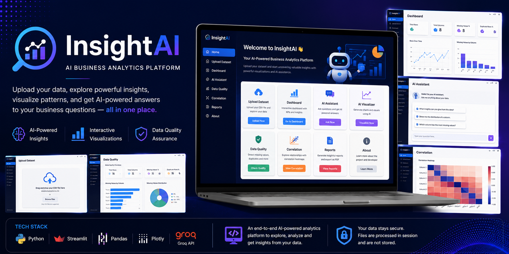
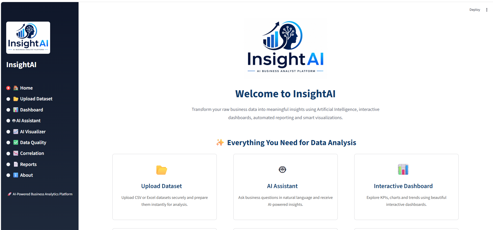
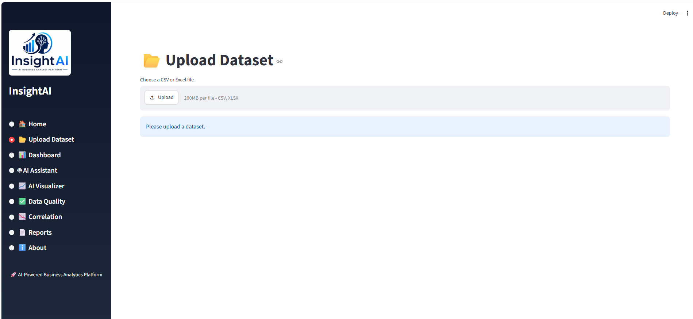
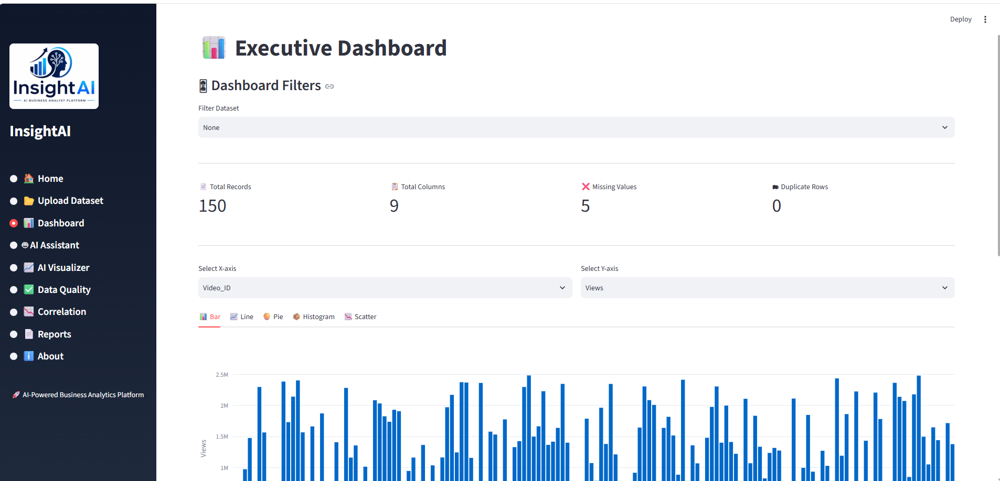
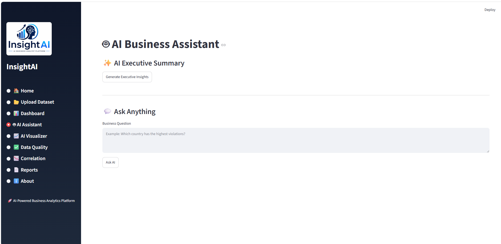
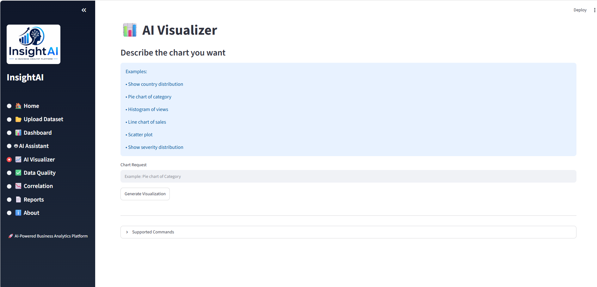
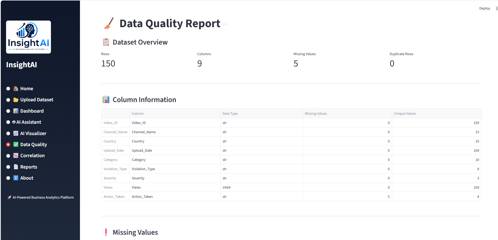
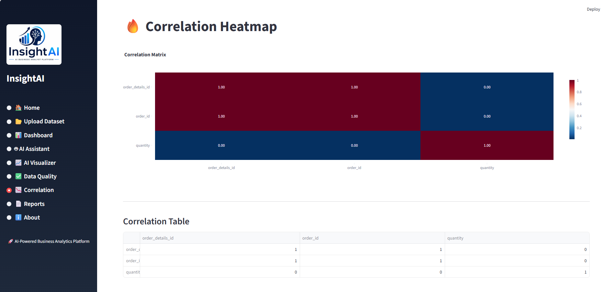
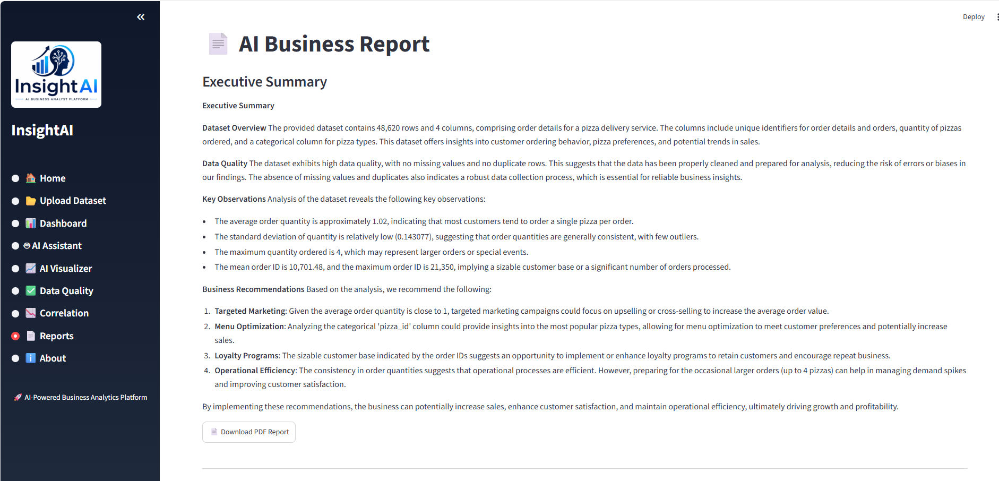
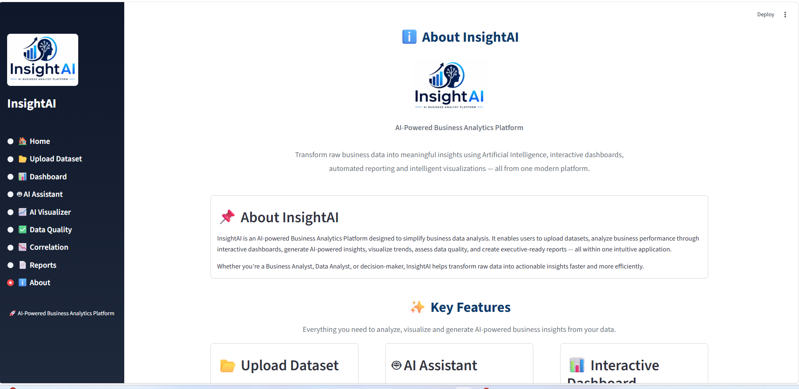

<p align="center">
  
</p>

<h1 align="center">🚀 InsightAI | AI Business Analytics Platform</h1>

<p align="center">
An AI-powered Business Analytics platform that transforms raw datasets into meaningful insights through interactive dashboards, intelligent visualizations, automated data quality analysis, and Generative AI.
</p>

<p align="center">


</p>

<p align="center">

<a href="https://github.com/harshitashrotriy-crypto/InsightAI">

</a>

<a href="#">

</a>

</p>

---

# 📖 Overview

**InsightAI** is an AI-powered Business Analytics platform that transforms raw datasets into actionable insights through interactive dashboards, intelligent visualizations, automated data quality analysis, and Generative AI.

Designed for analysts, business users, and data enthusiasts, the platform combines **Business Analytics**, **Exploratory Data Analysis (EDA)**, **Data Visualization**, and **Large Language Models (LLMs)** into a single intuitive application.

Users can upload datasets, explore key metrics, uncover trends, evaluate data quality, generate interactive visualizations, create analytical reports, and interact with their data using natural language.

InsightAI simplifies the analytics workflow by bringing essential data analysis capabilities together into one modern, user-friendly application.

---

# 🎯 Project Objectives

- Transform raw datasets into actionable business insights.
- Simplify Exploratory Data Analysis (EDA).
- Enable interactive and insightful data visualization.
- Improve data quality through automated validation checks.
- Leverage Generative AI for natural language data exploration.
- Generate professional analytical reports.
- Deliver a clean, intuitive, and responsive analytics experience.

---

# 🌐 Project Domains

- 📊 Business Analytics
- 🤖 Generative AI
- 📈 Exploratory Data Analysis (EDA)
- 📉 Data Visualization
- 🧹 Data Quality Assessment
- 📊 Business Intelligence
- 📑 Automated Reporting
- 💬 Natural Language Data Interaction

---

# 🚀 Core Features

- ✅ Upload and analyze CSV datasets
- ✅ Interactive KPI dashboards
- ✅ AI-powered Business Assistant using Groq LLM
- ✅ AI-driven data visualization
- ✅ Automated Data Quality Analysis
- ✅ Correlation Analysis
- ✅ Analytical Report Generation
- ✅ Modern and responsive Streamlit interface

---
# 🛠️ Technology Stack

| Category | Technologies |
|----------|--------------|
| **Programming Language** | Python |
| **Framework** | Streamlit |
| **Business Analytics** | KPI Analysis, Exploratory Data Analysis (EDA), Business Intelligence |
| **Data Processing** | Pandas, NumPy |
| **Visualization** | Plotly |
| **Generative AI** | Groq LLM API |
| **Data Quality** | Missing Value Analysis, Duplicate Detection, Correlation Analysis |
| **Reporting** | ReportLab |
| **Development** | VS Code |
| **Version Control** | Git & GitHub |

---

# 📸 Application Showcase

## 🏠 Home | 📂 Upload Dataset

| Home | Upload |
|------|--------|
|  |  |

---

## 📊 Dashboard | 🤖 AI Assistant

| Dashboard | AI Assistant |
|------------|--------------|
|  |  |

---

## 📈 AI Visualizer | ✅ Data Quality

| AI Visualizer | Data Quality |
|---------------|--------------|
|  |  |

---

## 🔥 Correlation Analysis | 📄 Reports

| Correlation | Reports |
|-------------|---------|
|  |  |

---

## ℹ️ About

<p align="center">

</p>

---

# ⭐ Why InsightAI?

✔️ AI-powered business analytics platform

✔️ Interactive dashboards for quick insights

✔️ Automated Exploratory Data Analysis (EDA)

✔️ Natural language AI assistant powered by Groq LLM

✔️ Professional analytical report generation

✔️ Modern, intuitive, and responsive user interface

✔️ End-to-end analytics workflow in a single application

---
# 🏗️ Project Architecture

```text
                          +----------------------+
                          |      User Uploads    |
                          |      CSV Dataset     |
                          +----------+-----------+
                                     |
                                     v
                        +-------------------------+
                        |    Data Processing      |
                        | Pandas • NumPy • EDA    |
                        +-----------+-------------+
                                    |
         ---------------------------------------------------------
         |             |             |             |             |
         v             v             v             v             v
 +---------------+ +------------+ +------------+ +------------+ +------------+
 | Dashboard     | | AI         | | AI         | | Data       | | Correlation|
 | Analytics     | | Assistant  | | Visualizer | | Quality    | | Analysis   |
 +---------------+ +------------+ +------------+ +------------+ +------------+
         \             |              |              |              /
          \____________|______________|______________|_____________/
                                    |
                                    v
                          +----------------------+
                          |   Reports & Insights |
                          +----------------------+
```

---

# 📂 Project Structure

```text
InsightAI/
│
├── app/
│   ├── pages/
│   │   ├── home.py
│   │   ├── upload.py
│   │   ├── dashboard.py
│   │   ├── ai_assistant.py
│   │   ├── ai_visualizer.py
│   │   ├── data_quality.py
│   │   ├── correlation.py
│   │   ├── reports.py
│   │   └── about.py
│   │
│   └── utils/
│       ├── ai.py
│       ├── chart_generator.py
│       ├── data_summary.py
│       └── pdf_generator.py
│
├── assets/
│   ├── banner.png
│   ├── InsightAI_logo.png
│   └── screenshots/
│
├── main.py
├── requirements.txt
├── README.md
└── .gitignore
```

# 🚀 Quick Start

Follow these steps to run **InsightAI** locally.

## 1. Clone the Repository

```bash
git clone https://github.com/harshitashrotriy-crypto/InsightAI.git
cd InsightAI
```

## 2. Install Dependencies

```bash
pip install -r requirements.txt
```

## 3. Configure Environment Variables

Create a `.env` file in the project root and add your Groq API key:

```env
GROQ_API_KEY=your_groq_api_key
```

> **Note:** Your API key is never stored in the repository. The `.env` file is excluded using `.gitignore`.

## 4. Run the Application

```bash
streamlit run main.py
```

Once the application starts, open the local Streamlit URL displayed in your terminal (typically `http://localhost:8501`).

---

---

# 💡 How to Use InsightAI

### Step 1
Upload a CSV dataset.

### Step 2
Explore the interactive Dashboard for KPIs and summary statistics.

### Step 3
Use the AI Assistant to ask business questions in natural language.

### Step 4
Generate charts through the AI Visualizer.

### Step 5
Review Data Quality metrics to identify missing values and duplicates.

### Step 6
Analyze feature relationships using the Correlation page.

### Step 7
Generate and download an analytical report.

---

# 🔒 Security

- API keys are stored securely using environment variables (`.env`).
- Sensitive credentials are excluded from version control through `.gitignore`.
- Uploaded datasets are processed within the active application session.
- No API keys or confidential information are exposed in the repository.

---
# 🔮 Future Enhancements

The following features are planned for future versions of InsightAI:

- 🔹 Support for Excel and JSON datasets
- 🔹 Database connectivity (MySQL, PostgreSQL, Snowflake)
- 🔹 Advanced machine learning model integration
- 🔹 Predictive analytics and forecasting
- 🔹 Interactive AI-generated dashboards
- 🔹 User authentication and role-based access
- 🔹 Dashboard export to PDF and PowerPoint
- 🔹 Cloud deployment with persistent storage
- 🔹 Multi-user collaboration and workspace management

---

# 👩🏻‍💻 About the Developer

### Harshita Shrotriy

Data Analyst passionate about **Business Analytics**, **Generative AI**, **Data Visualization**, and building intelligent data-driven applications that simplify decision-making.

### Skills

- 📊 Business Analytics
- 🤖 Generative AI
- 🐍 Python
- 📈 Streamlit
- 📉 Plotly
- 🐼 Pandas
- 🗄 SQL
- 📊 Tableau
- ❄️ Snowflake

---

## 🔗 Connect with Me

<p align="center">

<a href="https://github.com/harshitashrotriy-crypto">

</a>

<a href="https://www.linkedin.com/in/harshita-shrotriy-9573931a5/">

</a>

</p>

---

# 🙏 Acknowledgements

This project was built using the following open-source technologies:

- Python
- Streamlit
- Pandas
- NumPy
- Plotly
- Groq API
- ReportLab

Special thanks to the open-source community for providing the tools and libraries that made this project possible.

---

# 📄 License

This project is shared for educational and portfolio purposes.

Feel free to explore the code, learn from it, and provide feedback.

---

# ⭐ Support the Project

If you found this project useful:

⭐ Star this repository

🍴 Fork the repository

💡 Share your feedback

🤝 Connect with me on LinkedIn

---

<p align="center">

### 🚀 Built with Python, Streamlit & Generative AI

### Turning Raw Data into Actionable Business Insights

</p>

---

<p align="center">
<b>Thank you for visiting the InsightAI repository!</b>

If you enjoyed exploring this project, consider giving it a ⭐ on GitHub.
</p>
